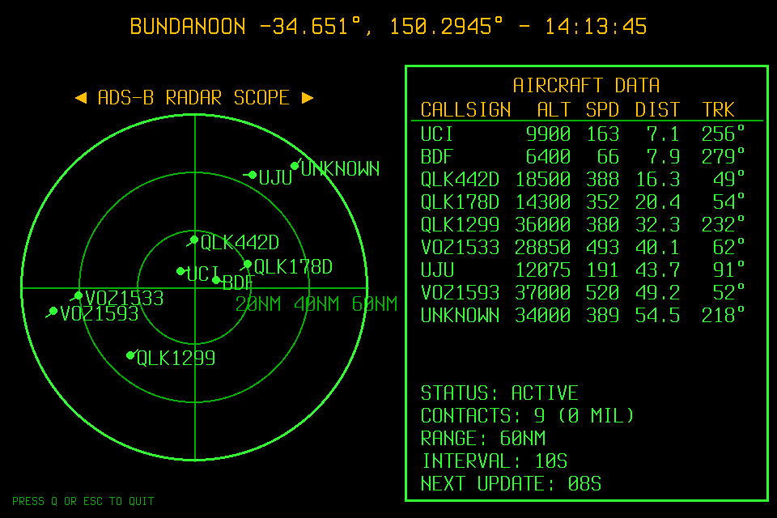

# Retro ADS-B Radar ✈

A local ADS-B radar display built with Python and Pygame. Visualises real-time aircraft positions and metadata from a local tar1090 server, with a retro CRT-style interface.



## Features
- Real-time radar visualisation of aircraft within a configurable radius
- Military aircraft detection (aircraft with military hex codes blink red)
- Tabular display of aircraft data (callsign, altitude, speed, distance, track)
- CRT scanline overlay and retro colour palette
- Terminus TTF fonts for an authentic look

## Quick Start

1. **Clone the repository:**
   ```bash
   git clone https://github.com/nicespoon/retro-adsb-radar.git
   cd retro-adsb-radar
   ```
2. **Install dependencies:**
   ```bash
   pip install -r requirements.txt
   ```
3. **Ensure tar1090 is running and accessible** at the configured IP (default: `localhost`).
4. **Run the radar UI:**
   ```bash
   python3 radar.py
   ```
   *Note:* On some systems, `python` may be used instead of `python3` if it points to Python 3.
5. **Quit:** Press `Q` or `ESC` in the radar window.

## Configuration
The application is configured via `config.ini` (see `config.ini.example` for a template). Copy `config.ini.example` to `config.ini` and adjust as needed:

```
[General]
FETCH_INTERVAL = 10                # Data fetch interval (seconds)
MIL_PREFIX_LIST = 7CF              # Comma-separated list of military aircraft hex prefixes (e.g. 7CF,AE,43C)
TAR1090_URL = http://localhost/data/aircraft.json  # tar1090 data source URL

[Location]
LAT = -31.9522                     # Radar center latitude
LON = 115.8614                     # Radar center longitude
AREA_NAME = PERTH                  # Displayed area name
RADIUS_NM = 60                     # Radar range (nautical miles)

[Display]
SCREEN_WIDTH = 1920                # Window width (pixels)
SCREEN_HEIGHT = 1080               # Window height (pixels)
FPS = 6                            # Frames per second
FONT_PATH = fonts/TerminusTTF-4.49.3.ttf  # Path to TTF font
```

- **MIL_PREFIX_LIST**: Accepts a comma-separated list of hex prefixes for military aircraft detection. Example: `MIL_PREFIX_LIST = 7CF,AE,43C` will highlight any aircraft whose hex code starts with one of these prefixes.
- **SCREEN_WIDTH** and **SCREEN_HEIGHT**: Using values other than the default ones will result in scaling issues with the UI.
- All configuration values can be overridden in your own `config.ini`.


## License
See font licenses in `fonts/`.